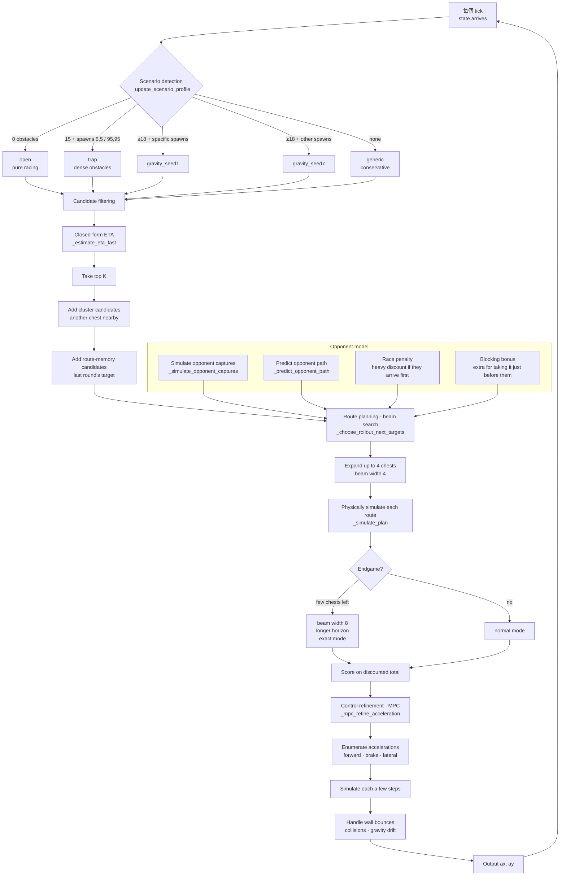

# YTP Arena — Pirate Chest Agent

**A competitive agent for the 2026 Youth Turing Project LCQ tournament.**

[English](README.md) | [繁體中文](README.zh-TW.md)

---

> **Scope of this repository**
>
> This repo contains **the strategy code I wrote myself** (`strategy.py`, 3,022 lines)
> and its runtime configuration. The arena platform and the `pirate_client` framework
> were provided by the organisers (Youth Turing Project) and are not included here,
> so cloning this repo alone will not run.
>
> The tournament concluded on 20 July 2026; this is published as a post-competition
> technical record.

---

## About the competition

Unlike IOI- or Codeforces-style problem solving, this was an **AI agent battle**:
each team wrote an autonomous agent that competed head-to-head across four fixed
scenarios, racing to collect treasure chests. There is no reference answer — the
outcome depends on strategy design and continuous iteration.

**Scoring**: the winner of each match takes 1 point; **a draw scores nothing for
either side**, and teams are ranked on total points. That rule shaped the whole
strategy — playing safe is worthless, so the agent has to work out which chests are
actually winnable and abandon the rest.

**Team**: 靈機一動.cpp — Yu-Shin Lan (captain), Yi-Chen Hsieh, Xing-Yan

**Result**: preliminary 23/99 → LCQ tournament **2/35**
(advancing in the top 15) → finals.

The format was a daily round robin: submissions were snapshotted at midnight, a full
tournament was run, and the leaderboard updated at 9am. The development rhythm was
therefore "ship a version, read the board the next morning" — most of the parameters
in this project were tuned exactly that way.

---

## Strategy design process

The full breakdown developed during the competition — eight base scenarios, 28 pairwise
combinations, the key four-way combinations, and which ideas never made it into the
final build — is recorded in
**[the strategy design document](docs/strategy-design.md)** (in Chinese).

The five-day ranking trajectory, what changed in each version, and one experiment that
failed (zig zag), are recorded in **[the development log](docs/development-log.md)**
(in Chinese).

Intermediate versions are preserved under **[`versions/`](versions/)**: from eight
standalone modules (38–84 lines each), through a 1,329-line merge, to the final 3,022
lines. One step in that chain *removes* lines — not every commit should add something.

---

## Core design

Every tick, the agent decides one thing: **which direction to accelerate.**

That decision is split into four layers:

```
scenario detection → candidate filtering → route planning (beam search) → control (MPC)
```


---

## Architecture




### 1 · Scenario detection

`_update_scenario_profile()`

Obstacle layouts and spawn points are fixed per map, so on the first tick the agent
identifies which map it is on from the **obstacle count plus both spawn coordinates**,
then switches an entire parameter set:

| Profile | Condition | Character |
|---|---|---|
| `open` | 0 obstacles | Open field, pure racing |
| `trap` | 15 obstacles + spawns at (5,5) / (95,95) | Dense obstacles, requires detours |
| `gravity_seed1` | ≥18 obstacles + specific spawns | Gravity field present |
| `gravity_seed7` | ≥18 obstacles + different spawns | Gravity field, different layout |
| `generic` | none of the above | Conservative fallback |

**This is tuning against fixed maps, not a general solution.** On an unseen layout the
agent falls back to `generic` and performs noticeably worse. That trade-off was
deliberate — with maps fixed by the format, targeted tuning pays far more than
generality.

### 2 · Candidate filtering

Simulating every chest fully is too expensive, so a closed-form ETA estimate
(`_estimate_eta_fast`) ranks them first, accounting for acceleration and speed caps,
and the top K advance.

Two extra classes of candidate are kept:

- **Cluster candidates** — worse on their own ETA, but "there's another chest right
  next to it", so the combined payoff may be higher
- **Route-memory candidates** — the target chosen last round, to stop the agent
  changing its mind every tick

### 3 · Route planning

`_choose_rollout_next_targets()` · `_simulate_plan()`

A **beam search** expands "which chests next, in what order" — up to 4 chests deep,
beam width 4 (widened to 8 in the endgame). Each route is physically simulated to
produce an actual capture-time sequence, then scored on discounted total value.

The opponent is part of the plan:

- `_simulate_opponent_captures()` — which chests the opponent will likely take
- `_predict_opponent_path()` — the opponent's projected trajectory
- **Race penalty** — a chest the opponent reaches first is heavily discounted
- **Blocking bonus** — taking a chest just before the opponent arrives scores extra

In other words, the agent isn't only computing its own fastest route — it's computing
**which chests are winnable and which to abandon.**

### 4 · Control refinement

`_mpc_refine_acceleration()`

Once planning fixes a target, the control layer runs a short-horizon MPC: it
enumerates several candidate accelerations (drive forward, brake, lateral offsets),
simulates each a few steps ahead, and picks the best.

This layer handles what planning cannot see: wall bounces, obstacle collisions, and
drift caused by gravity fields.

---

## Trade-offs recorded during development

**114 constants, all tuned empirically.** The parameter block at the top of the file
is the largest part of this project, and each entry corresponds to one cycle of
"change it, read the leaderboard tomorrow, keep or revert".

A few judgements worth recording:

- **`MIN_COMMIT_TICKS`** — early versions replanned every tick, and the agent
  oscillated between two chests and collected neither. A minimum commitment window
  fixed it.
- **Opponent-simulation dt widened 5× on gravity maps**
  (`OPPONENT_SIM_DT_MULTIPLIER_SEED1`) — trajectories vary too much under gravity for
  fine-grained simulation to mean anything; a coarse estimate is both steadier and
  cheaper.
- **Exact mode in the endgame** (`ENDGAME_EXACT_ENABLED`) — below a threshold of
  remaining chests, beam width and horizon both increase, because every chest now
  carries heavy weight.
- **The `SCORE_PRESSURE_*` group** — take more risk when behind, play conservatively
  when ahead.

---

## Known limitations

- **Scenario detection depends on fixed maps.** Unseen layouts fall back to generic.
- **Parameters were tuned against a specific opponent pool.** With a fixed round-robin
  field, some weights — especially blocking and race penalties — likely overfit those
  opponents' behaviour.
- **The opponent model assumes a rational shortest-path chaser.** Prediction degrades
  against deliberate interference or irrational play.
- **No learning component.** Everything is rules and search; no trained model.

---

## Tests

```bash
python -m pytest tests/ -v
# or without pytest:
python tests/test_strategy.py
```

**32 unit tests across five core computation functions**, runnable without the arena
environment (0.001s). These target the numerical foundation of the agent — if any of
them is wrong, the beam search and MPC above are built on bad numbers.

| Function under test | What is verified |
|---|---|
| `_time_to_cover_1d` | Against the closed form `t = √(2d/a)`; the accelerate/cruise boundary; initial-speed clamping; monotonicity in distance |
| `_clamp_vector` | Correct length after scaling and **an exactly preserved direction**; near-zero vectors return zero rather than blowing up into an arbitrary heading |
| `_capture_gap_between_chests` | Clamps to 0 rather than going negative when capture zones overlap; symmetry; ship-radius effect |
| `_chest_key` | Floating-point noise must not split one chest into two; keys must be hashable |
| `_point_near` | Tolerance boundaries; **both axes must match** (a single-axis match would misidentify the map) |

`strategy.py` imports the organiser-provided `pirate_client`, which is not included in
this repo, so the test file injects a minimal stub before importing — letting the pure
functions be tested in isolation.

---

## Stack

Python 3.11 · Docker · `websockets`
Single-file implementation, no external dependencies beyond the organiser-provided
`pirate_client`.

## Author

Yu-Shin Lan · Shin Min High School, Taichung, Taiwan
